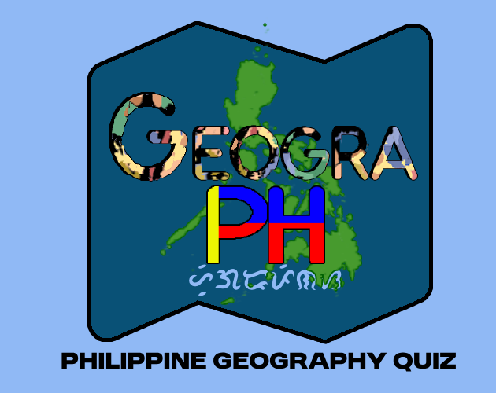

# *GeograPH: Philippine Geography Quiz*

# What is GeograPH? 

An obvious pun of Geography of the Philippines also works in Tagalog as __HeograPinas__.
It is a quiz game made using Godot v4.2.2 about Philippine geography with the main goal of teaching geography in a simple and fun way.

## How do you play it?
The questions mainly revolve around the different regions of the Philippines. Including the regional numbers, region center, and an enumeration of the cities or provinces belonging to it. It features two main game modes:

1. Flashcard Quizzes
    - Choose the correct answer between four options before the time runs out\!

2. Interactive Map Quiz
    - Navigate through the Philippine map to locate and identify the correct region

### Free Roam Mode
Getting stuck? View the Philippine map derived from [this map](https://commons.wikimedia.org/wiki/File:Ph_regions_and_provinces.svg) within the game and learn from your mistakes.

## How can you play?
Download the game for android or play in the browser in [Itch.io](https://likhalaro.itch.io/geograph)

## What else is there?

This game is inspired due to my own lack of knowledge of Philippine geography (or geography in general) and also serves as a simple project. I enjoy making games no matter how simple they get >_<

### Resources:
* Fonts: [Dafont](https://www.dafont.com/)
* Map: [Wikipedia](https://commons.wikimedia.org/wiki/File:Ph_regions_and_provinces.svg)

### Future Updates:
* Include a matching game mode and link the city to the correct region
* Include an enumeration game mode that lists down the cities and provinces and construct the region's map
* Introduce new gameover mechanics such as limited lives and limited questions
* Include the cities and provinces to be interactive locations

***
- See other projects: [Github Page](https://johnmatthewbautista.github.io/)
- View other games: [Itch.io Page](https://likhalaro.itch.io/)

